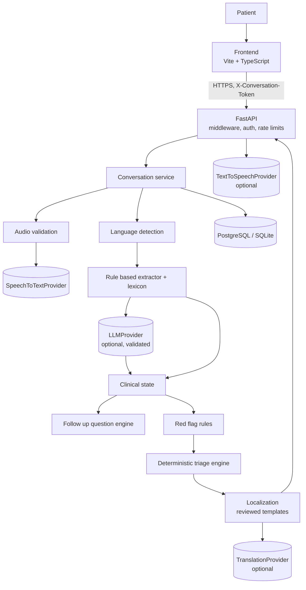

# Architecture

## Overview

## Layers

| Layer | Path | Responsibility |
|---|---|---|
| API | `app/api` | Routing, schemas, auth dependency, rate limits, size limit and request id middleware |
| Services | `app/services` | Conversation orchestration, localization |
| Domain | `app/domain` | Clinical state model (pydantic) |
| Clinical | `app/clinical` | Lexicon, extractor, state merge, rules, triage engine, question engine. No I/O |
| AI providers | `app/ai` | `LLMProvider`, `TranslationProvider`, LLM output validation |
| Speech | `app/speech` | `SpeechToTextProvider`, `TextToSpeechProvider`, audio validation |
| Persistence | `app/database`, `app/models`, `database/migrations` | ORM, repository, Alembic |
| Core | `app/core` | Settings, logging, errors, metrics, security helpers, versions |

The `clinical` package imports nothing from the web, database or provider layers. That keeps safety logic testable in
isolation and impossible to bypass from a provider.

## Data flow for one patient turn

1. Frontend posts text (typed, or a reviewed transcript from voice) to `/messages`.
2. Text is normalised (invisible characters removed, length checked). A prompt injection screen runs.
3. `clinical.extractor.extract` produces symptoms, negations, duration, age, temperature and context from the lexicon.
4. If an LLM is configured, is enabled and the text passed the injection screen, `ai.extraction` may add symptoms. Each addition
   must quote words that really occur in the message. Invalid output is discarded and counted.
5. `clinical.state.merge_extraction` updates the persisted `ClinicalState`. `questions.apply_answer` interprets short
   replies such as "haan" for the pending question.
6. `triage.evaluate` runs the rules. On emergency the service stops questioning. Otherwise `questions.next_question` picks the
   next question or the conversation is finalised.
7. `Localizer` renders the structured result in the patient's language. The state, messages, observations, assessment and audit
   event are saved in one transaction.

## Trust boundaries

* **Patient to API.** Everything is untrusted: text, audio, headers, ids. Validated by pydantic, size limits and audio
  signature checks.
* **API to AI providers.** Only the single current message crosses this boundary (plus audio for speech to text). No name,
  contact detail, conversation id or earlier history is sent. The LLM prompt is a constant, the patient text is delimited and
  declared as data.
* **AI providers to application.** Provider output is untrusted. It is parsed, schema validated, checked against the patient's
  own words, and can only add present findings.
* **Application to database.** Only parameterised ORM statements. Free text is confined to `conversation_messages`.

## AI boundary and safety boundary

The LLM may help to read language. It may not decide urgency, remove a finding, lower severity, produce patient facing
text or touch the emergency path. Patient facing sentences are fixed templates reviewed by humans. If the LLM is unreachable the
rule based extractor and engine still produce a complete, safe result.

## External dependencies

| Dependency | Used for | If unavailable |
|---|---|---|
| Speech to text API | Voice transcription | Voice button reports unavailable. Typing works |
| LLM API | Extra understanding, optional translation | Rules only |
| Text to speech API | Read aloud | Browser voice, else text only |
| PostgreSQL | State and history | Readiness check fails. API returns 500 with an error id |

## Database interactions

`conversations` holds the clinical state as JSON plus the hashed access token and expiry. `conversation_messages` holds the
transcript. `clinical_observations` is an append only log of codes. `triage_assessments` stores each evaluation with rules
triggered and versions. `audit_events` holds operational events without patient wording and survives deletion with the
conversation id removed.

## Scaling notes

* The rate limiter and metrics registry are in process. With several replicas, enforce limits at the gateway or move both to a shared store.
* Provider calls are blocking HTTP calls inside threadpool workers. Size the worker pool for expected concurrency.
* Run migrations as a one off job before rolling out replicas.
